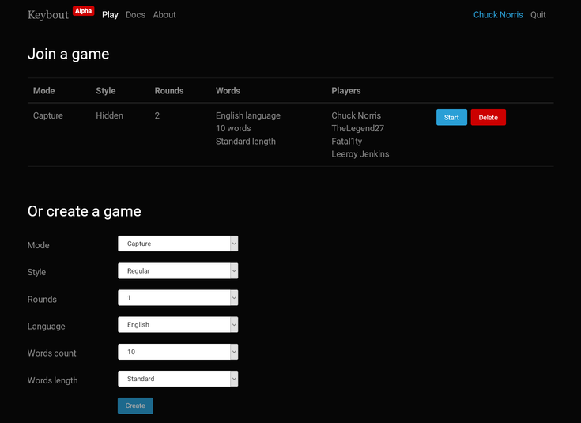

# Keybout

Keybout is a simple web-based multiplayer keyboard racing game, where the players
have to type random words before the other players.

The first version started in 2014 as a sample WebSocket application and used JavaScript,
WebSocket, Java EE 7 and Java.

This second version, started in 2019, is a full rewrite based on Angular, SockJS, Spring Boot and Kotlin.

The application home page:

The page used to create a join a game:

The main page of the game:
- Blue words are available, quickly type them (some letters are missing since this game uses the "hidden" style)
- Green words were won by the current player
- Red words were won by other players

When a round is over, this page displays the results:

## Usage

Prerequisites: Java 8+, Node.js 10+ with NPM

To start the frontend locally, run `npm install` then `ng serve` in `keybout-frontend`
or use your IDE.

To start the backend locally, run `mvnw spring-boot:run` in `keybout-backend`
or use your IDE.

To build a single deployable fat jar containing the whole application,
run `mvnw package -Pfull` from the home folder then use `keybout-backend/target/keybout-backend.jar`.
Omit `-Pfull` if you prefer to separate the fontend and backend packages.

The application uses an optional MongoDB database to persist some data,
if the `spring.data.mongodb.uri` is defined.

To run in production, deploy the fat jar and run with several environment variables:
- APPLICATION_DATATYPE: "prod"
- LOG_DATEFORMAT_PATTERN: optional, use an empty string (i.e. two consecutive double quotes) to disable the timestamp
in the Spring logs when the cloud platform (such as Heroku) adds its own timestamp
- SPRING_DATA_MONGODB_URI: optional, the MongoDB URI
